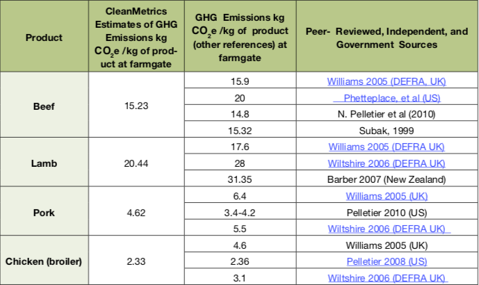
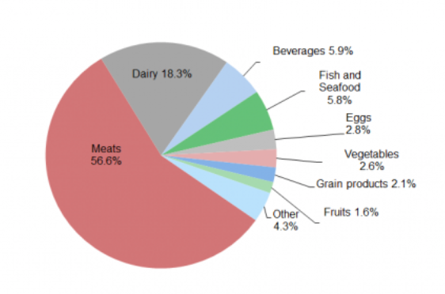

```{r setup, include=FALSE}
options(htmltools.dir.version = FALSE)
knitr::opts_chunk$set(
	echo = FALSE,
	message = FALSE,
	warning = FALSE
)
# options(knitr.table.format = "html")
library(tidyverse)
library(babynames)
library(fontawesome) # from github: https://github.com/rstudio/fontawesome
library(dplyr)
library(quantmod)

```


```{r cache=TRUE, include=FALSE}
loc <- c("Nor","OutE","Nor", "Nor", "Nor", "Eur") %>% as.factor()
category <- c("Grain","F&Veg", "Meat", "Fish", "Dairy", "Drinks") %>% as.factor()
month <- as.factor(1:12)
n = length(month) 
## Oslo


location = data.frame(category, loc)

funny = function(r, st){
  # grain = sample(seq(152, 500, 10)*30 , n, replace=T) # thousand
  grain_nor = sample(seq(50, 300, 5)*30 , n, replace=T) # thousand
  grain_eur = sample(seq(152, 500, 5)*30 , n, replace=T) # thousand
  grain_out = sample(seq(152, 500, 5)*30 , n, replace=T) # thousand
  
  
  # f.veg = sample(seq(152, 500, 10)*30 , n, replace=T)    # thousand
  f.veg_nor = sample(seq(20, 200, 5)*30 , n, replace=T)
  f.veg_eur = sample(seq(150, 500, 5)*30 , n, replace=T)
  f.veg_out = sample(seq(150, 500, 5)*30 , n, replace=T)
  
  
  # meat = sample(seq(152, 500, 10)*30 , n, replace=T)    # thousand
  meat_nor = sample(seq(40, 200, 5)*30 , n, replace=T)
  meat_eur = sample(seq(200, 500, 5)*30 , n, replace=T)
  meat_out = sample(seq(150, 500, 5)*30 , n, replace=T)
  
  
  # fish = sample(seq(152, 500, 10)*30 , n, replace=T)    # thousand
  fish_nor = sample(seq(100, 400, 5)*30 , n, replace=T) 
  fish_eur = sample(seq(200, 500, 5)*30 , n, replace=T) 
  fish_out = sample(seq(300, 500, 5)*30 , n, replace=T) 
  

  # dairy = sample(seq(152, 500, 10)*30 , n, replace=T)    # thousand
  dairy_nor = sample(seq(100, 300, 5)*30 , n, replace=T)
  dairy_eur = sample(seq(150, 500, 5)*30 , n, replace=T)
  dairy_out = sample(seq(150, 500, 5)*30 , n, replace=T)
  
  
  # drinks = sample(seq(152, 500, 10)*30 , n, replace=T)    # thousand
  drinks_nor = sample(seq(100, 300, 5)*30 , n, replace=T)
  drinks_eur = sample(seq(150, 500, 5)*30 , n, replace=T)
  drinks_out = sample(seq(150, 500, 5)*30 , n, replace=T)
  
  
  visitor = sample(seq(50,150,5)*30,12)
  
  city = as.factor(rep(r,n))
  
  store = as.factor(rep(st,n))
  
  return(data.frame(month, 
                         grain_nor, grain_eur, grain_out,
                         f.veg_nor, f.veg_eur, f.veg_out,
                         meat_nor, meat_eur, meat_out,
                         fish_nor, fish_eur, fish_out, 
                         dairy_nor, dairy_eur, dairy_out,
                         drinks_nor, drinks_eur, drinks_out,
                         visitor, city, store))}

oslo.st = c("st1","st2","st3","st4")
berg.st = c("st1", "st2","st3")
trond.st = c("st1","st2")

st = list(oslo.st, berg.st, trond.st)

cty = c("Oslo", "Bergen", "Trondheim")

data = list()
sub.data = list()

for (i in 1:length(cty)){
  d =sum(lengths(st[[i]]))
  for(j in 1:d){
    sub.data[[j]] = funny(cty[i] ,st[[i]][j])}
  data[[i]] = do.call(rbind, sub.data)}

fin.data = do.call(rbind, data)

grain <- fin.data %>% select(grain_nor,grain_eur,grain_out) 

f.veg <- fin.data %>% select(f.veg_nor, f.veg_eur, f.veg_out)

meat <- fin.data %>% select(meat_nor, meat_eur, meat_out)

fish <- fin.data %>% select(fish_nor, fish_eur, fish_out)

dairy <- fin.data %>% select(dairy_nor, dairy_eur, dairy_out)

drinks <- fin.data %>% select(drinks_nor, drinks_eur,drinks_out) 

attach(fin.data)
```

layout: true
  
<div class="my-footer"><span>Busenur Kızılaslan/Ducky Interview</span></div>

<!-- this adds the link footer to all slides, depends on my-footer class in css-->

---
name: xaringan-title
class: right, bottom
background-image: url("img/robert-bye-dOElUitX2Do-unsplash.jpg")
background-size: cover


# <span style="color: white;">**Footprint Calculations with** </span>

# <span style="color: white;">**REMA1000 Data** </span>

<br> 

###<span style="color: white;">Busenur Kızılaslan</span>


<!-- this ends up being the title slide since seal = FALSE-->

---
class: right, middle
background-image: url("img/ycol.jpg")
background-size: cover


### Busenur Kızılaslan

### Research Assistant / Marmara University

[`r fa(name = "github")` @busenurk](https://github.com/busenurk)  
[`r fa(name = "link")` avesis/busenurkizilaslan](https://avesis.marmara.edu.tr/busenur.sarica)    
[`r fa(name = "paper-plane")` busenur.sarica@gmail.com](mailto:busenur.sarica@gmail.com)

---
class: center, middle, inverse
background-image: url("img/geran-de-klerk-WJkc3xZjSXw-unsplash.jpg")
background-size: cover


# Thank you for your contribution to the healing of the world!

```{r echo=FALSE , out.width = '7%', fig.align='center',fig.cap=""}
 
```


---
class: left
background-image: url("img/matthew-henry-2Ts5HnA67k8-unsplash.jpg")
background-size: cover

# Outline
--------
<br>


### 🚩 Discussing the advantages and disadvantages of data

<br>
--

###  🚩 Emphasizing key points

---

### 🥕 Due to the estimated global population growth to approximately 9 billion in 2050 and growing income levels, The Food and Agriculture Organization of the United Nations (FAO) suggests that a 70% increase in food production will be necessary.

--

### .heatinline[🥕 In Europe, food consumption is responsible for approximately 30% of total GHG emissions.]

<br>

-------

[How to Feed the World in 2050. High Level Expert Forum. Food and Agriculture Organization of the United Nations, Rome, 2009.](https://reliefweb.int/report/world/how-feed-world-2050-high-level-expert-forum-rome-12-13-oct-2009-investment)

[Guinée, J., Heijungs, R., De Koning, A., Van, L., Geerken, T., Van Holderbeke, M., ... & Delgado, L. (2006). Environmental Impact of Products (EIPRO) Analysis of the life cycle environmental impacts related to the final consumption of the EU25](http://citeseerx.ist.psu.edu/viewdoc/summary?doi=10.1.1.400.4293)

---
class: left

<br>

<br>

<br>

## .heatinline[How would you go about integrating REMA1000's data into footprint calculations across Norway?]

```{r echo=FALSE , out.width = '20%', fig.align='right',fig.cap=""}
knitr::include_graphics("https://media.giphy.com/media/3R3PNPNf35ZgAaPbBH/giphy.gif") 
```

---

<br>

.pull-right[
```{r echo=FALSE , out.width = '80%', fig.align='center',fig.cap=""}
 
```
]

---------

### 📌 The data includes monthly purchases by category grain, fruit & veg .heatinline[(f.veg)], meat, fish, dairy, drinks. 


--

### 📌 The product location split into Norway .heatinline[(nor)], Europe .heatinline[(eur)], Outside of Europe .heatinline[(out)]
 

--

### 📌 Data is given on a store level, not an individual level, but we do know how many people visit .heatinline[(visitor)] the store each month.

---
## 🌎 Location based categories

-----------

### Each category is defined based on its location as Norway, Europe, and Outside of Europe.

.pull-left[
```{r echo=FALSE}
head(meat)
```


```{r}
head(fish)
```

]

.pull-right[

```{r}
head(grain)
```

```{r}
head(drinks)
```

]
---

## Get a glimpse of data

------

```{r echo=FALSE}
str(fin.data)
```

---

## Example dataset

-------

```{r echo=FALSE}
ex.data <- fin.data %>% select(month, grain_nor, grain_eur, grain_out, drinks_nor, visitor, city,store) 

ex.data %>% head(23)
```


---
<br>

### We are currently in the process of integrating another factor - .heatinline[the percentage of food which is bought locally.] 

--

.pull-left[

### In this scenario, we are interested in only <u>food bought by customers.</u> If we want to integrate the percentage of food that is bought locally with this dataset, we need to learn how much food is wasted in the REMA1000.]

.pull-right[
```{r echo=FALSE , out.width = '60%', fig.align='center',fig.cap=""}
knitr::include_graphics("https://media.giphy.com/media/621xh7AP4wDraEgdLt/giphy.gif") 
```
]


---
<br>

### Location information in the dataset is an advantage because it allows us to add the effect of transportation to our model.

<br>

--

### .heatinline[Internal transport information is also important for footprint calculation. If we can access this type of detailed data, our model could be more reliable.]

<br>

-----
[Górny, K., Idaszewska, N., Sydow, Z., & Bieńczak, K. (2021). Modelling the carbon footprint of various fruit and vegetable products based on a company’s internal transport data. Sustainability, 13(14), 7579](https://www.mdpi.com/2071-1050/13/14/7579)


---

### We should create new features for transportation. .saltinline[Locations of products can not be evaluated with an equal carbon footprint.] 

<br>

.pull-left[

### A transport assignment should be made depending on the distance between each city and location.

<br>

]

.pull-right[
```{r echo=FALSE , out.width = '30%', fig.align='center',fig.cap=""}
knitr::include_graphics("https://media.giphy.com/media/RhkNaujdz2u6qLH7NN/giphy.gif") 
```
]


### Obtaining information about <u>the means of transportation</u> used will also make our analysis more realistic.


---

### We need to calculate the carbon footprint for each category. In this example, an average meat carbon footprint is calculated by using this reference table.

.pull-left[

<br>

### We should use .heatinline[the average footprint for each category] because we do not have detailed purchase information.

] 


.pull-right[
```{r echo=FALSE , out.width = '100%', fig.align='center',fig.cap=""}
 
```

]


------------

[Meat Eaters Guide, Environmental Wroking Group](https://static.ewg.org/reports/2011/meateaters/pdf/methodology_ewg_meat_eaters_guide_to_health_and_climate_2011.pdf)

---

### At this point, the selection of the metric (mean or median) is important.

.pull-left[

```{r echo=FALSE}
meat_sub = cbind(beef = 15.23, lamb = 20.44, pork = 4.62, chicken = 2.33)
mean.meat = mean(meat_sub)
median.meat = median(meat_sub)
dif = mean.meat - median.meat
cbind(mean.meat, median.meat, dif)
```

<br>


### 📈 As the amount of food increases, the amount of deviation will also increase.

```{r echo=TRUE}
dif*1000
```
]

.pull-right[
```{r echo=FALSE , out.width = '100%', fig.align='center',fig.cap=""}
 
```

]


------------

[Meat Eaters Guide, Environmental Wroking Group](https://static.ewg.org/reports/2011/meateaters/pdf/methodology_ewg_meat_eaters_guide_to_health_and_climate_2011.pdf)
---

<br>


### If we want to compare cities, stores, or months, we need to each category values divided by the number of visitors.  

<br>

### We should standardize the dataset because <u>all categories do not have the same unit.</u>

<br>

```{r}
ex.data %>% filter(month==c(2)) %>% head(9)
```

---
## Generalization of results

---------

.pull-left[

### Norway had a population of 5.381.326 in October 2021([Statistisk Norway](https://www.ssb.no/en/befolkning/folketall/statistikk/tettsteders-befolkning-og-areal)).


<br>

### .heatinline[We have a dataset of about 28% of the population but is it enough for our analysis?] ]


.pull-right[

```{r echo=FALSE}
library(plotly)

cat <- c("Oslo", "Bergen", "Trondheim", "Other")
values <- c(1043168, 265470, 191771, 3880917)

m <- list(l = 50, r = 50, b = 100, t = 100, pad = 4)

pop = data.frame(cat,values)
fig <- plot_ly(pop, labels = ~cat, values = values, type = 'pie')
fig <- fig %>% layout(title = '',
         xaxis = list(showgrid = FALSE, zeroline = FALSE, showticklabels = FALSE),
         yaxis = list(showgrid = FALSE, zeroline = FALSE, showticklabels = FALSE),
         autosize = F, width = 450, height = 450, margin = m)
fig
```

]

---

<br>

### REMA1000 dataset includes only customers from big cities (Although Stavanger is among the big cities, it is not included in the data). The dataset can not represent customers from small cities.

<br>

--

### If we want to calculate footprint <u>across Norway</u>, we need to use additional datasets such as Kiwi, Meny, Coop for homogeneity. .heatinline[The data can not represent the all population of Norway.]

---

### .heatinline[Seasonality contribution should be included in the model.]

--

### ♻️ Quantification of the reduction potential from a commonly recommended option, .heatinline[‘eating seasonal’], showed that consuming tomatoes and carrots seasonally in Sweden could **reduce the carbon footprint by 30-60%.** 

--

### Local and seasonal products have a lower carbon footprint than other products. We should keep in mind the detail when we design our model.

<br>

--------

[Röös, E. (2013). Analysing the carbon footprint of food (Vol. 2013, No. 2013: 56).](https://pub.epsilon.slu.se/10757/1/roos_e_130821.pdf)

---

### 💸 Locally bought food is generally more expensive than food bought overseas therefore most of the customers are inclined towards non-local products. 

### We have to add this effect to our model. 

<br>

```{r}
head(fish)
```

<br>
$$\widehat{CF\_fish} = (w1*fish\_nor+w2*fish\_eur+w3*fish\_out)*\overline{CF\_fish}$$

where $w3>w2>w1$.

---

<br>

### If we can access additional information such as;

###📎 packaging type, 

###📎 water usage, 

### we can improve our footprint calculations.

<br>

### Outliers are another significant issue, the presence of outliers in the data should be checked before beginning the analysis.


---
class: left
background-image: url("img/y1.jpg")
background-size: cover

```{r echo=FALSE , out.width = '30%', fig.align='right',fig.cap=""}
knitr::include_graphics("https://media.giphy.com/media/KGYpdymW4TkhP8qOIu/giphy.gif") 
```

# Future Ideas

---

<br>

### 🚀 My main field, .heatinline[fuzzy logic], can be used to incorporate uncertainty in the system into the model. There are articles on this subject in the literature.

<br>

[Morone, P., Falcone, P. M., & Lopolito, A. (2019). **How to promote a new and sustainable food consumption model: A fuzzy cognitive map study.** Journal of cleaner production, 208, 563-574.](https://www.sciencedirect.com/science/article/pii/S0959652618330890?casa_token=W83z0BNOELIAAAAA:CHV4RtCAoqzxbE--DE699xxVPzXBNPoCTeiUYzTcM0NaUPr4MT4GsmeGHpz_O7e1mU_i6mjIKxA)


[Egilmez, G., Gumus, S., Kucukvar, M., & Tatari, O. (2016). **A fuzzy data envelopment analysis framework for dealing with uncertainty impacts of input–output life cycle assessment models on eco-efficiency assessment.** Journal of cleaner production, 129, 622-636.](https://www.sciencedirect.com/science/article/pii/S0959652616301822?casa_token=XLgNeVlKLy8AAAAA:twRUCkheoM765iShA_GHc7NdjIabi1pPG4uAJdm5_eQQk5HoyLkTF_YUlsxgE7VSUsvViTqUSKA#!)


[Banaeian, N., Mobli, H., Fahimnia, B., Nielsen, I. E., & Omid, M. (2018). **Green supplier selection using fuzzy group decision making methods: A case study from the agri-food industry.** Computers & Operations Research, 89, 337-347.](https://www.sciencedirect.com/science/article/pii/S0305054816300399?casa_token=GTuCJUH5aT0AAAAA:I7AF9ofvu8rPUEqKVtZwF7AC9Xre9uLQQrlmE8G0Q6UM7HWTl5XSvsQs0dPXfWuUScC6su15Hkw)

---

<br>

### 🚀 Meats are the most important part of carbon footprint. We can forecast future meat bought by converting our dataset to a supervised problem. 

.pull-left[
```{r}
fore.meat <- fin.data %>% select(month,meat_out)


cbind(fin.data$month, Lag(fore.meat[,2],(4:1)), meat_out=fore.meat[,2]) %>% head(10)
```
]


.pull-right[
```{r echo=FALSE , out.width = '80%', fig.align='center',fig.cap=""}
 
```
]

--------------

[Center for Sustainable Systems, Carbon Footprint Factsheet, University of Michigan](https://css.umich.edu/factsheets/carbon-footprint-factsheet)

---
class: center, middle
background-image: url("img/bergen.jpg")
background-size: cover

# .heat[**TAKK!**]


